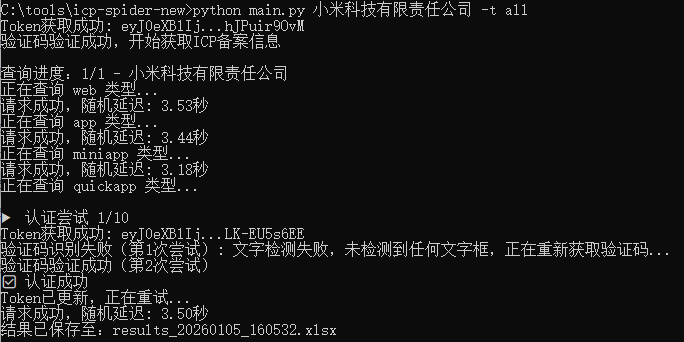
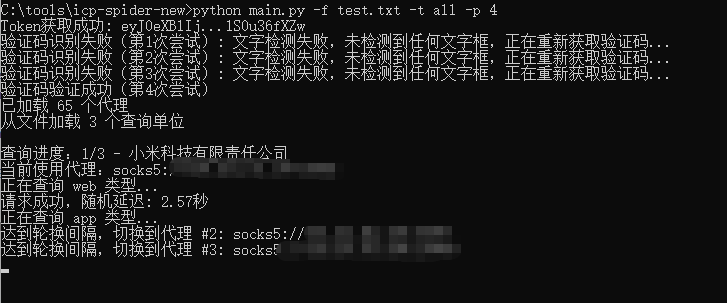
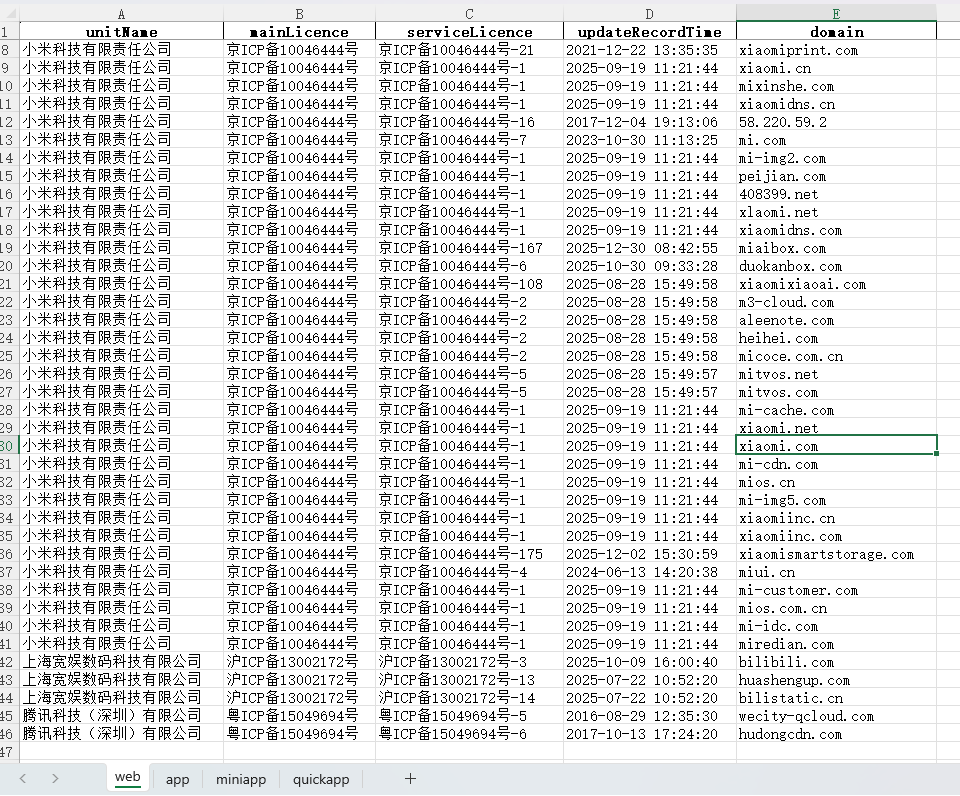
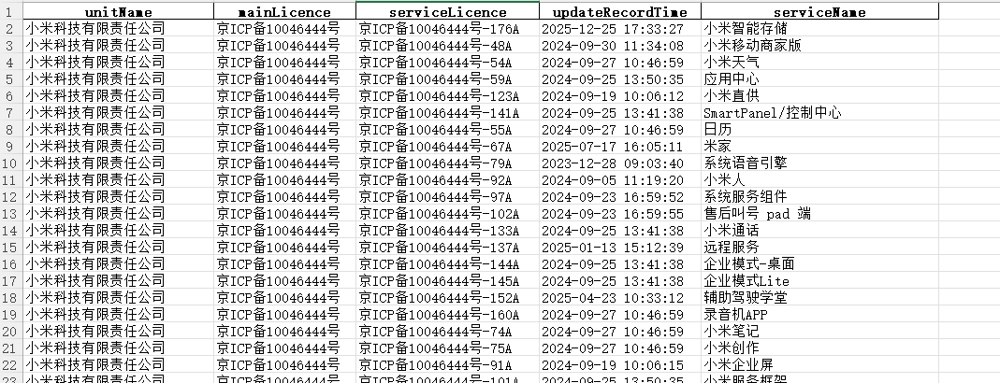
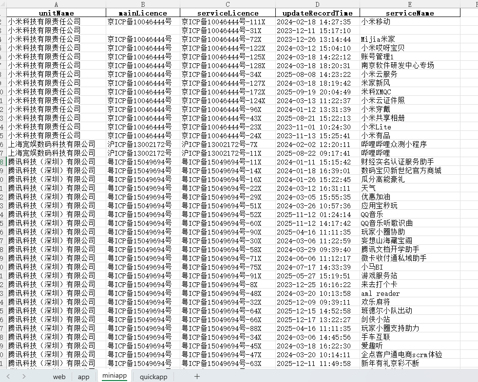
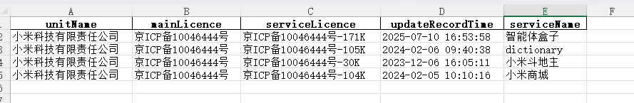

# 自动化ICP备案信息批量查询

验证码识别部分来源：
https://github.com/ravizhan/ICP-spider

引用该项目识别验证码+deepseek结合自己的脚本

## 警告

本项目仅限用于学习研究

禁止售卖本项目，禁止用于违法目的

任何后果与本人无关

## 概述

自动化查询指定公司名称的ICP备案信息（域名、APP、小程序）

> 主要用于企业资产测绘
>
> 因时效性要求，需从工业和信息化部政务服务平台查询实时数据


## 功能

1. 单公司名称查询（不实用）
2. 指定文件查询多个公司ICP备案信息
3. 通过代理查询多个公司ICP备案信息
5. 将查询结保存到本地文件中。

## 依赖

- Python 3.10/3.11
- 换环境后python 3.14出现了No matching distribution found for onnxruntime的问题

通过以下命令安装所需的库：

```bash
pip install -r requirements.txt
```

## API

> 主要接口：https://hlwicpfwc.miit.gov.cn/icpproject_query/api/icpAbbreviateInfo/queryByCondition

## 使用方法

1. **运行脚本**：

```bash
   python main.py [-h] [-f FILE] [-o OUTPUT] [-t {web,app,miniapp,quickapp,all}] [-p PROXY_ROTATE] [unit_name]
   ICP备案查询工具

positional arguments:
  unit_name             查询的单位名称

options:
  -h, --help            show this help message and exit
  -f FILE, --file FILE  批量查询文件
  -o OUTPUT, --output OUTPUT
                        输出文件名
  -t {web,app,miniapp,quickapp,all}, --type {web,app,miniapp,quickapp,all}
                        查询类型:网站、APP、小程序、快应用、全部
  -p PROXY_ROTATE, --proxy_rotate PROXY_ROTATE
                        代理轮换间隔（每个代理处理N个请求后切换）
```

2. **查询单公司**

   ```
   python main.py xxxx有限公司 -t all
   ```

   

4. **查询多个公司(代理)**

   ```
   python main.py -f Company.txt -t all -p 3
   ```

   


查询结果：

web



app



miniapp



quickapp



## 鸣谢


[Siamese-pytorch](https://github.com/bubbliiiing/Siamese-pytorch) 孪生神经网络

[ultralytics](https://github.com/ultralytics/ultralytics) YOLOv8

[ICP-spider](https://github.com/ravizhan/ICP-spider) ICP-spider


## 开源协议


依据上游项目 [ultralytics](https://github.com/ultralytics/ultralytics) 所使用的AGPLv3协议，现以相同协议开源本项目，请自觉遵守。
