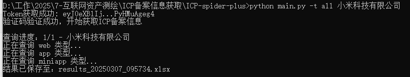
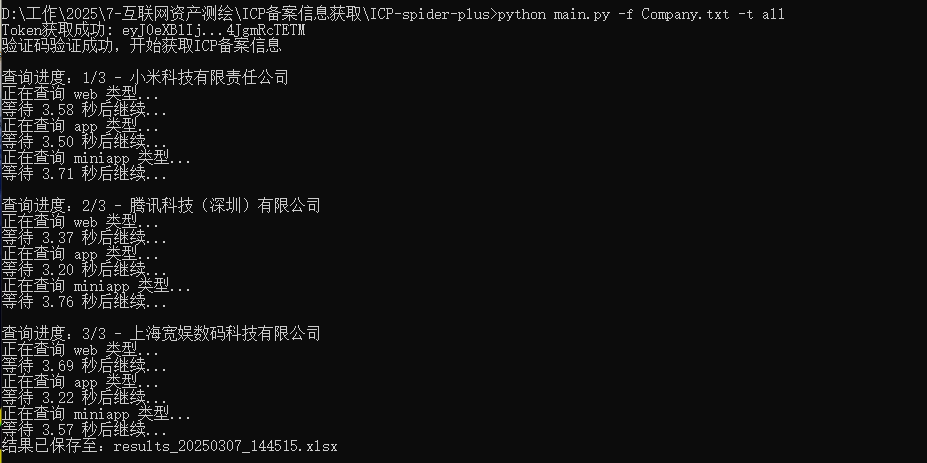
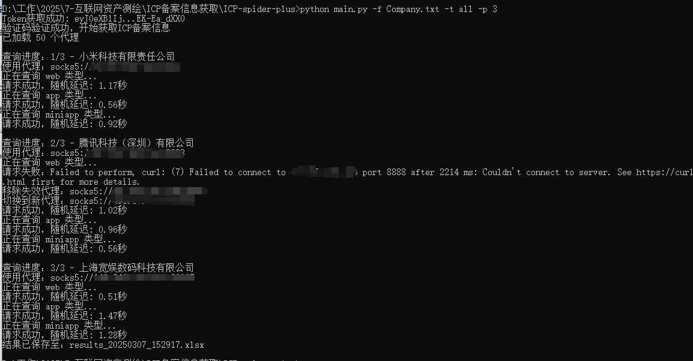
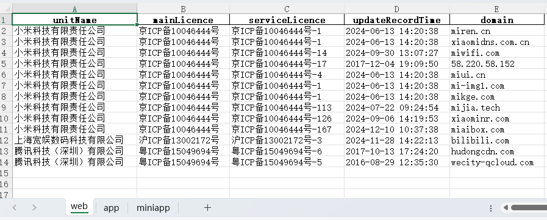
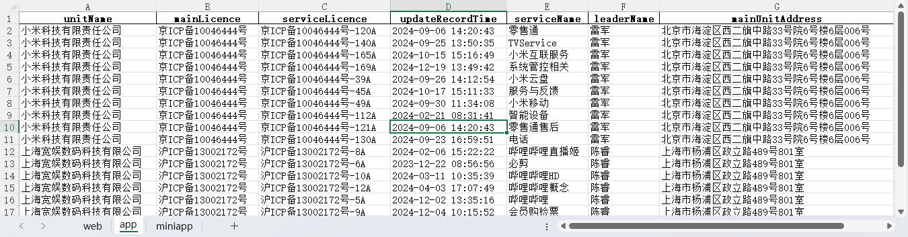
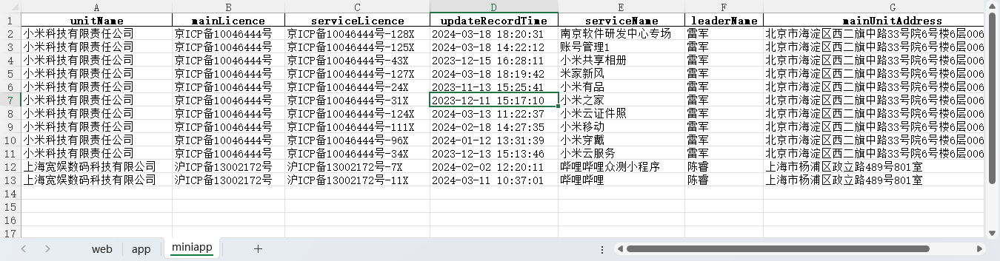

# 自动化ICP备案信息批量查询

验证码识别部分来源：
https://github.com/ravizhan/ICP-spider

引用该项目识别验证码+deepseek结合自己的脚本

## 警告

本项目仅限用于学习研究

禁止售卖本项目，禁止用于违法目的

任何后果与本人无关

## 概述

自动化查询指定公司名称的ICP备案信息（域名、APP、小程序）

> 主要用于企业资产测绘


## 功能

1. 单公司名称查询（不实用）
2. 指定文件查询多个公司ICP备案信息
3. 通过代理查询多个公司ICP备案信息
5. 将查询结保存到本地文件中。

## 依赖

- Python 3.x

通过以下命令安装所需的库：

```bash
pip install -r requirements.txt
```

## 认证信息获取

> 主要接口：https://hlwicpfwc.miit.gov.cn/icpproject_query/api/icpAbbreviateInfo/queryByCondition

## 使用方法

1. **运行脚本**：

```bash
   python ICP.py [-h] [-f FILE] [-o OUTPUT] [-t {web,app,miniapp,all}] [-p PROXY_ROTATE] [unit_name]
   ICP备案查询工具

positional arguments:
  unit_name             查询的单位名称

options:
  -h, --help            show this help message and exit
  -f FILE, --file FILE  从文件读取单位名称列表
  -o OUTPUT, --output OUTPUT
                        输出文件名
  -t {web,app,miniapp,all}, --type {web,app,miniapp,all}
                        查询类型（域名、APP、小程序、全部）
  -p PROXY_ROTATE, --proxy_rotate PROXY_ROTATE
                        启用代理且每N个请求更换代理
```

2. **查询单公司**

   ```
   python ICP.py xxxx有限公司 -t all
   ```

   

3. **查询多个公司**

   ```
   python ICP.py -f Company.txt -t all
   ```

   

4. **查询多个公司(代理)**

   ```
   python ICP.py -f Company.txt -t all -p 3
   ```

   


查询结果：







## 鸣谢


[Siamese-pytorch](https://github.com/bubbliiiing/Siamese-pytorch) 孪生神经网络

[ultralytics](https://github.com/ultralytics/ultralytics) YOLOv8

[ICP-spider](https://github.com/ravizhan/ICP-spider) ICP-spider


## 开源协议


依据上游项目 [ultralytics](https://github.com/ultralytics/ultralytics) 所使用的AGPLv3协议，现以相同协议开源本项目，请自觉遵守。
